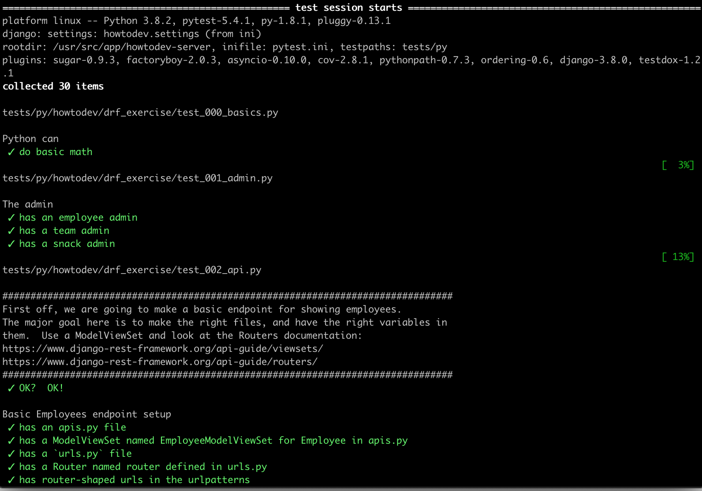
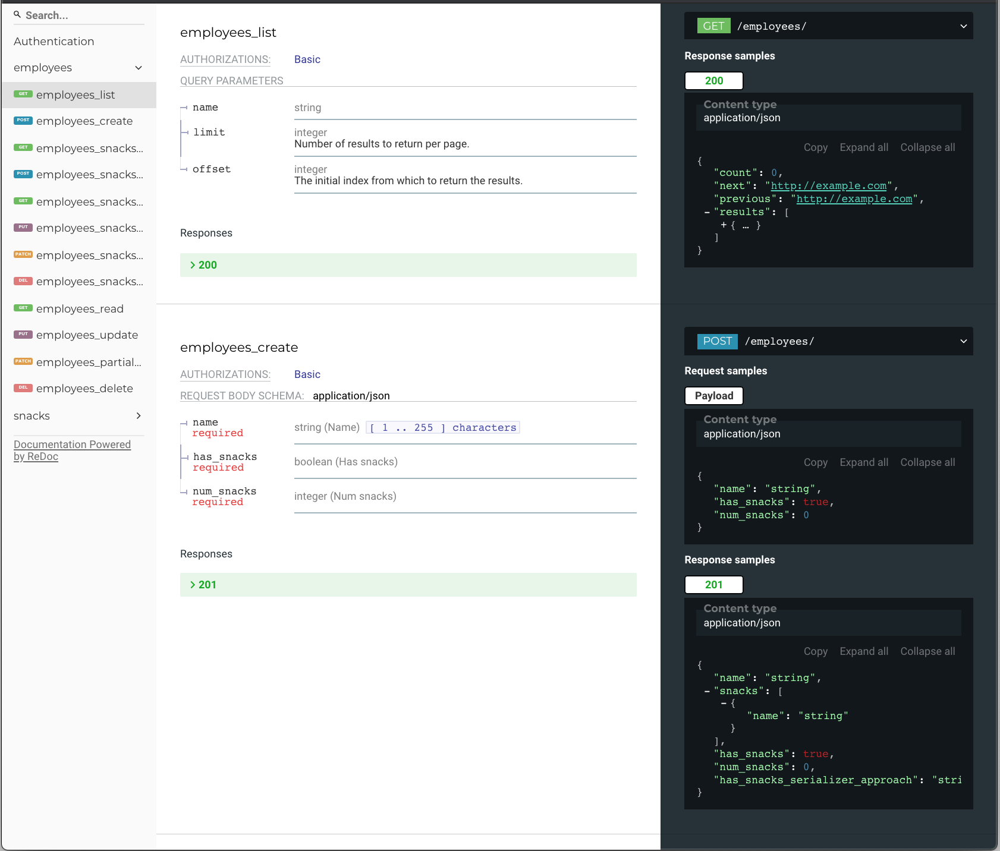
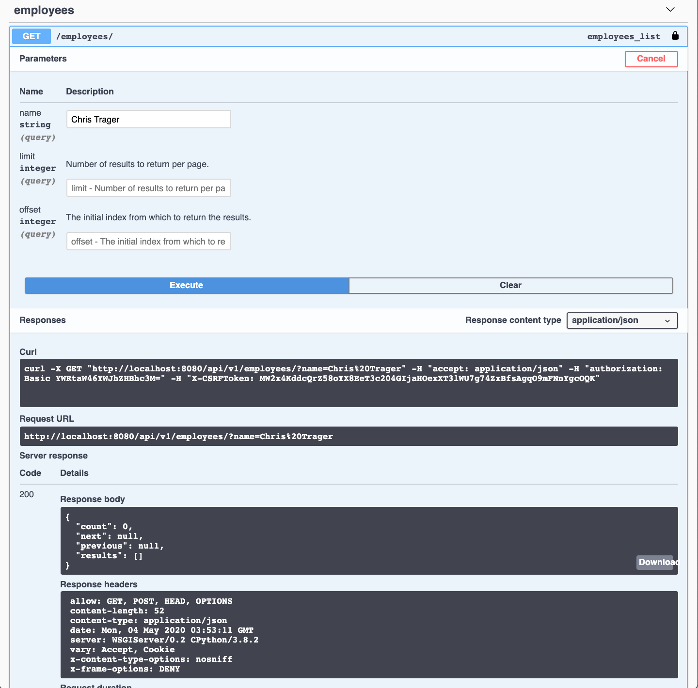

# Howtodev DRF

Work through a series of tests setting up example DRF APIs, culminating in autogenerated, browsable, Redoc-documentation and an interactive API dashboard.

Run the tests with:

    docker-compose up -d
    docker exec -it howtodev-server bash
    pytest

The tests:

The Redocs:

The API dash:

Based on [howtodev](https://github.com/bwarren2/howtodev).

## Setup TLDR

Bring it up with `docker-compose up -d`

Migrate the DB: `docker exec -it howtodev-server python howtodev/manage.py migrate`

You now have a Django admin user `admin` with password `abadpass`.

Vue is served on `http://localhost:8001/`

Django is served on `http://localhost:8080/`, with the API root at `http://localhost:8080/api/`.

If you want to use the vue UI, swap the commented/uncommented commands in `howtodev-vue` in `docker-compose.yml`.

Run tests within the server container (`docker exec -it howtodev-server bash`) with `pytest`!
